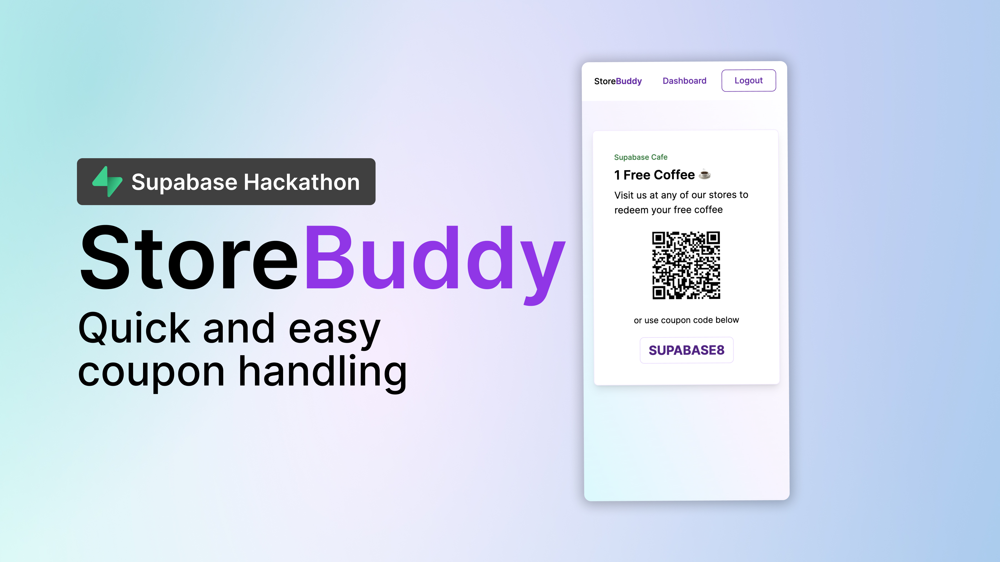

# Store Buddy

> Submission for Supabase Launch 8 Hackathon



## Concept

_Create digital coupons in minutes and use them in your physical stores._

Coupons are not new. However, the landscape is a little diferent now. With the growing number of online retailers, modern coupons and vouchers are geared more towards businesses that operate digitally.

What about physical business? Most are still using paper-based coupons for their promotions.

**StoreBuddy** aims to bring digital coupons to brick-and-mortar businesses. A simple solution that you can integrate to your business's operations.

[Watch the demo](https://youtu.be/rwd2YWMGjPg)

## Install dependencies

```bash
npm i
```

## Developing

Start a development server by running:

```bash
npm run dev

# or start the server and open the app in a new browser tab
npm run dev -- --open
```

## Building

To create a production version of your app:

```bash
npm run build
```

You can preview the production build with `npm run preview`.
